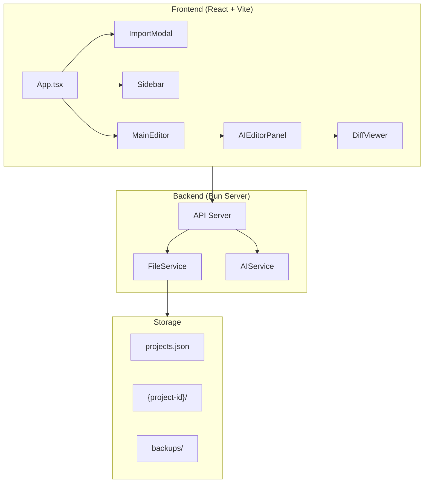

# FastWrite 完整重构计划

## 架构概览



## 删除的文件

| 文件 | 原因 |

|------|------|

| `src/cli.ts` | 不再需要 CLI |

| `src/systemPrompt.ts` | 合并到后端 |

| `web/src/components/SentenceSuggestions.tsx` | 用新的 AIPanel 替代 |

## 保留并重构的文件

| 文件 | 改动 |

|------|------|

| [`src/server.ts`](src/server.ts) | 扩展 API 端点 |

| [`src/diffUtils.ts`](src/diffUtils.ts) | 添加词级别 diff |

| [`web/src/App.tsx`](web/src/App.tsx) | 重构为新架构 |

| [`web/src/types/index.ts`](web/src/types/index.ts) | 新增类型定义 |

---

## Phase 1: 数据模型与存储层

**目标**: 实现 `design/01-import-paper-refined.md` 中定义的数据结构

### 新增类型 (`web/src/types/index.ts`)

```typescript
interface Project {
  id: string;
  name: string;
  type: 'local';
  localPath: string;
  createdAt: string;
  status: 'active' | 'archived';
}

interface ProjectConfig {
  projectId: string;
  sectionsDir: string;
  backupsDir: string;
  mainFile?: string;
}

type ViewMode = 'section' | 'paragraph' | 'sentence';
type AIMode = 'diagnose' | 'refine' | 'quickfix';

interface TextItem {
  id: string;
  content: string;
  type: ViewMode;
  level?: number;        // 1=section, 2=subsection (仅 Section 模式)
  children?: TextItem[]; // subsection 嵌套 (仅 Section 模式)
  lineStart?: number;
}
```

### 后端存储 (`src/projectConfig.ts`)

- 重构为管理 `projs/projects.json` (项目列表)
- 每个项目有独立目录: `projs/{project-id}/`

---

## Phase 2: Import Modal 组件

**目标**: 实现本地目录导入功能

### 新建 `web/src/components/ImportModal.tsx`

- 选择本地目录路径
- 自动检测 .tex 文件结构
- 显示文件预览树
- 创建项目配置

### API 端点 (`src/server.ts`)

```
POST /api/projects/import-local
  body: { path: string, name: string }
  response: Project

GET /api/projects
  response: Project[]

DELETE /api/projects/:id
```

---

## Phase 3: Sidebar 重构

**目标**: 实现文件树 + 文档大纲

### 重构 `web/src/components/FileExplorer.tsx`

改为 `Sidebar.tsx`，包含:

1. **项目选择器**: 下拉切换已导入的项目
2. **Import 按钮**: 打开 ImportModal
3. **文件树**: 递归显示 .tex 文件
4. **文档大纲**: 解析 `\section{}`、`\subsection{}` 生成可点击列表

---

## Phase 4: MainEditor 核心解析器

**目标**: 实现三级粒度视图 (Section/Paragraph/Sentence)

### 核心函数 (`web/src/utils/parser.ts`)

```typescript
function parseContent(content: string, mode: ViewMode): TextItem[]
// Section: 按 \section 和 \subsection 分割，保持层级结构
//   - 每个 \section 作为一个顶级 item
//   - 每个 \subsection 作为其父 section 的子 item
//   - TextItem 需要支持 children 属性表示层级关系
// Paragraph: 按 \n\n 分割  
// Sentence: 按句号分割 (复用现有 diffUtils)

interface TextItem {
  id: string;
  content: string;
  type: ViewMode;
  level?: number;        // 1=section, 2=subsection
  children?: TextItem[]; // 用于 subsection 嵌套
  lineStart?: number;
}
```

### 重构 `web/src/components/MainEditor.tsx`

1. **顶部栏**: 文件名 + ViewMode 切换器 (Section | Paragraph | Sentence)
2. **内容区**: 

   - Section 模式: 递归渲染层级结构（section 可展开/折叠显示 subsection）
   - Paragraph/Sentence 模式: 平铺渲染 TextItem[] 为可点击块

3. **选中逻辑**: 点击 item 高亮并打开 AIPanel

---

## Phase 5: AI 编辑面板

**目标**: 实现 Diagnose/Refine/QuickFix 三模式

### 新建 `web/src/components/AIEditorPanel.tsx`

1. **按钮栏**: Diagnose | Refine | QuickFix
2. **编辑区**: 左侧 textarea 编辑选中 item
3. **配置区**: System Prompt + User Prompt 输入
4. **结果区**: AI 返回后显示 DiffViewer

### 后端 LLM 服务 (`src/llmService.ts`)

```typescript
interface AIRequest {
  mode: AIMode;
  content: string;
  systemPrompt?: string;
  userPrompt?: string;
}

// 不同模式使用不同的默认 prompt
const PROMPTS = {
  diagnose: "分析写作逻辑是否清晰...",
  refine: "润色并改进表达...",
  quickfix: "检查语法、拼写错误..."
}
```

---

## Phase 6: Diff 视图增强

**目标**: 词级别差异对比

### 重构 `web/src/components/DiffViewer.tsx`

- 左侧: 原文 (删除标红)
- 右侧: 新版本 (新增标绿) + 可编辑
- 底部: Accept | Reject 按钮

### 增强 `src/diffUtils.ts`

- 新增 `computeWordDiff()` 函数
- 返回词级别的增删标记

---

## 实现顺序

| 阶段 | 预计工作量 | 依赖 |

|------|-----------|------|

| Phase 1: 数据模型 | 1 天 | - |

| Phase 2: Import Modal | 1 天 | Phase 1 |

| Phase 3: Sidebar | 1 天 | Phase 1, 2 |

| Phase 4: MainEditor | 2 天 | Phase 1, 3 |

| Phase 5: AI Panel | 2 天 | Phase 4 |

| Phase 6: Diff 增强 | 1 天 | Phase 5 |

**总计**: 约 8 天